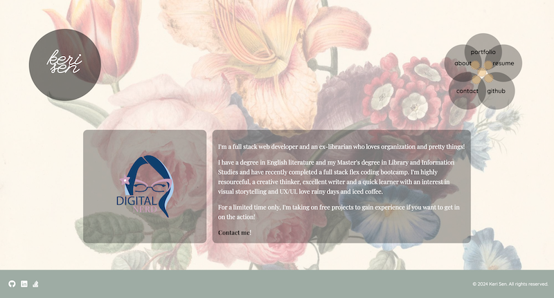
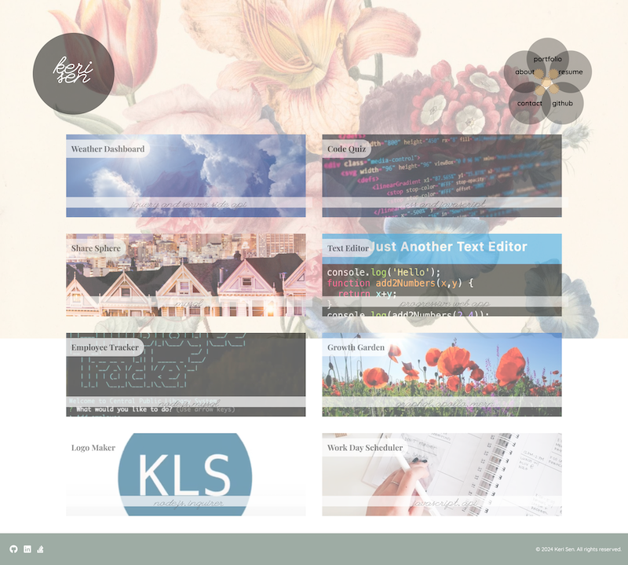
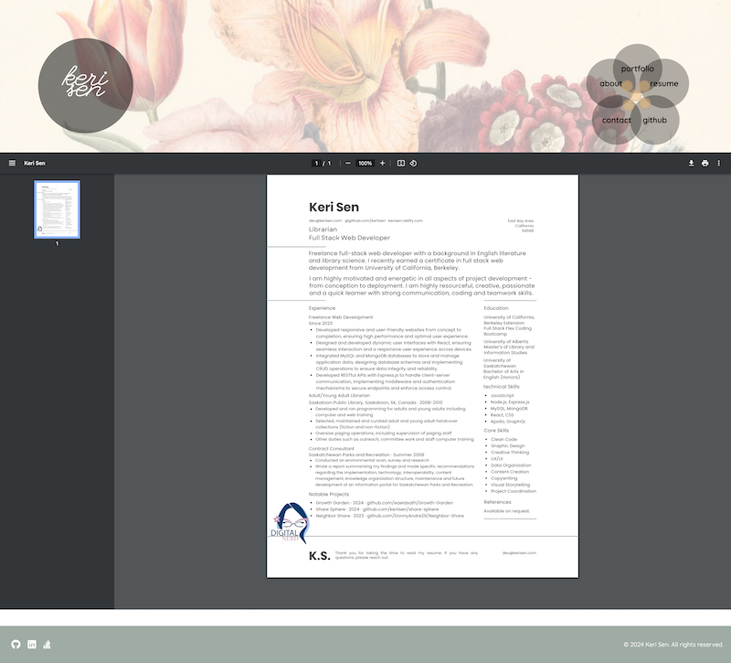
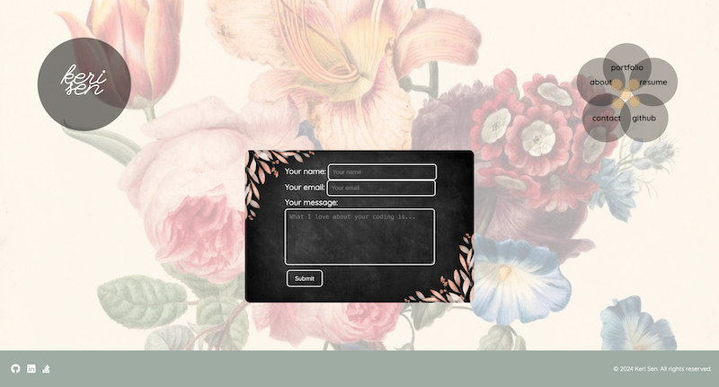

# Keri Sen Portfolio

  ## Description

  

  GitHub repository: [https://github.com/kerilsen/react-portfolio](https://github.com/kerilsen/react-portfolio)

  Deployed link: [https://kerisen.netlify.app](https://kerisen.netlify.app)

  This is a personal website designed to showcase my full stack web development skills. It is built using React and Styled Components and contains a portfolio showing my MERN web development skills as well as my design and teamwork skills. There is a Contact Me section for a user to submit a message using a form and a Resume section that allows the user to view or download my resume as a PDF. 

## Table of Contents

- [Installation](#installation)
- [Usage](#usage)
- [Contributing](#contributing)
- [License](#license)
- [Tests](#tests)
- [Questions](#questions)

  ## Installation

  1. Go to the root directory of the project in your terminal 
  2. Run `npm i` to install 
  3. Run `npm run dev` to run the development script
  4. Navigate to `http://localhost:5173/` in your browser to view the site

  ## Usage

  Navigate to the url at [Netlify](https://kerisen.netlify.app) and you will enter the site on the "About" page.
  
  Hover over the navigation links on the right side and click on the "portfolio" link to view my web portfolio.

Click on the "resume" link to view and/or download a pdf version of [my resume](./public/assets/KeriSenResume.pdf).

Please feel free to click on the "contact" link to send me a message!

  ## Contributing

* Background photo of Flower Illustration Painting from [Unsplash](https://unsplash.com/photos/pink-and-white-flower-painting-SMWPYQhVRuY)
* Assistance with animating the navigation menu from ChatGPT

  ## License

  [License: MIT License](https://opensource.org/licenses/MIT)

  ## Tests

  n/a

  ## Questions

  If you have any questions about this project, please contact me at dev@kerisen.com.

  My GitHub profile is at: [https://github.com/kerilsen](https://github.com/kerilsen)
